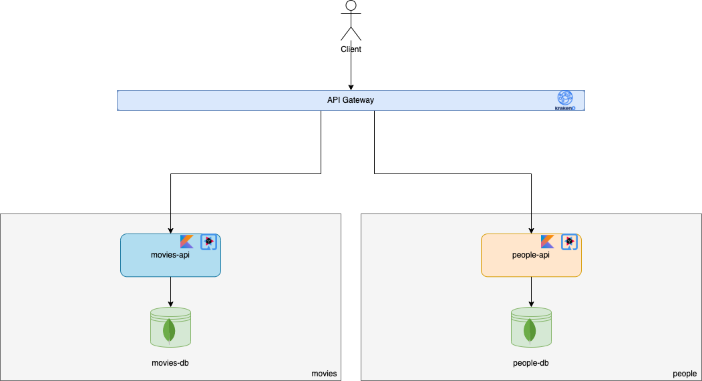

# Building a Knowledge Base Service With Neo4j and the Outbox Pattern

## Introduction

This article describes a real situation that happened when I worked for a previous company sometime ago. The main goal here is to explain both the problem as well as the solution so that it can also help someone that may run into the same problem eventually in the future.

Without further delay, let's then begin. I was working in an innovative insurance software project and one of the use cases that needed to be developed was the user having the possibility of knowing which entities (of any type) were related with another entity, for example, when were those relationships and entities created, what kind of relationship the entities had between them, among other things. 

Our software was built using a microservices architecture with many services, so this was not an easy task, since each service had its own database, its own specific API to perform CRUD operations on the entities, etc. We needed to create a scalable, generic and abstract way of querying the information, regardless of entity type. 

The big question that my team and I had was
> **How are we going to implement this?**

*The first solution that comes to the mind to solve this problem is somewhat simple to imagine: whenever the user wants to know what are the relationships a particular object has, the object's correspondent service that got the request just makes synchronous HTTP requests to the other services to get the list of objects that are referencing it. However, that could never be the chosen approach to our problem, there are numerous drawbacks, one of them being the increase in coupling between our services. Not only that, but also the service that first receives the request isn't even aware there are other neighbour services around it, and it doesn't need to know, since it is one of the advantages of using a microservices architecture. Other problems with this approach would be the high number of*

## The Problem

In our specific case, we had several insurance business concepts, but for simplification purposes, let's make an analogy of the problem but using instead the simple concepts of "Person" and "Movie", for this example.

Let's imagine we have a service for each entity, `people-api` and `movies-api` that are exposed through a [KrakenD](https://www.krakend.io/) API Gateway. The `people-api` service is responsible to provide CRUD functionalities for the entity "Person", through a REST API and the `movies-api` service is responsible to provide CRUD functionalities for the entity "Movie", through a REST API as well. Both services are written in [Kotlin](https://kotlinlang.org/) using the [Quarkus](https://quarkus.io/) framework and each one of them has its own [MongoDB](https://www.mongodb.com/) database. Until now, the following diagram describes the current situation.

Let's now imagine that we want to know which movies a given person directed and what were the actors (an actor is a person, in this context) and their roles in those movies. This is quite a complex query, given the fact that our entities are persisted in different databases. 

A possible solution would be to have inter service communication through the API gateway and aggregating responses, but that would be extremely complex to code and would increase the coupling of our services, decrease cohesion and also each service would have to know the contract of the other services, etc. In this particular case, it would work, yes, but what if we're dealing with hundreds or even thousands of microservices? And what if we have hundreds of business concepts and have to implement every possible query combination? Beyond that, this solution is not scalable due to the fact that we're talking about synchronous requests that may take a long time for several reasons.

## The Solution

After a few long meetings and discussions, we decided to investigate some possible solutions to our problem by doing some proofs of concept and came up with a pretty decent solution.

Eventually, we came up with something like the following figure shows us and that's exactly what we've built.

### How the magic happens

## Final thoughts

You can find all the source code of the project [here](https://github.com/thegoncalomartins/outbox-inbox-patterns)

## TL;DR
* a
* b
* c

### References

* [Reliable Microservices Data Exchange With the Outbox Pattern](https://debezium.io/blog/2019/02/19/reliable-microservices-data-exchange-with-the-outbox-pattern/) - Gunnar Morling
* [Pattern: Transactional outbox](https://microservices.io/patterns/data/transactional-outbox.html) - Chris Richardson
* [Event-Driven Architecture and the Outbox Pattern](https://medium.com/engineering-varo/event-driven-architecture-and-the-outbox-pattern-569e6fba7216) - Rod Shokrian
* [Resilient Eventing in Microservices, using the Outbox Pattern](https://medium.com/@sohan_ganapathy/resilient-eventing-in-microservices-using-the-outbox-pattern-ed0b10ea3ef8) - Sohan Ganapathy
* [Sending Reliable Event Notifications with Transactional Outbox Pattern](https://medium.com/event-driven-utopia/sending-reliable-event-notifications-with-transactional-outbox-pattern-7a7c69158d1b) - Dunith Dhanushka
* [Outbox Pattern for reliable data exchange between Microservices](https://medium.com/codex/outbox-pattern-for-reliable-data-exchange-between-microservices-9c938e8158d9) - Eresh Gorantla
