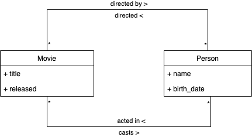
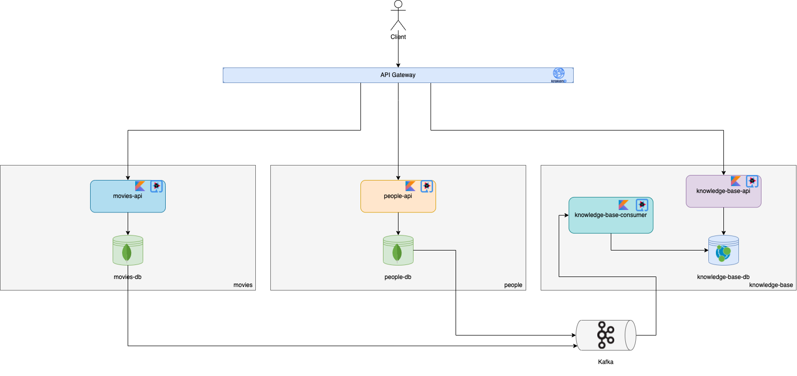
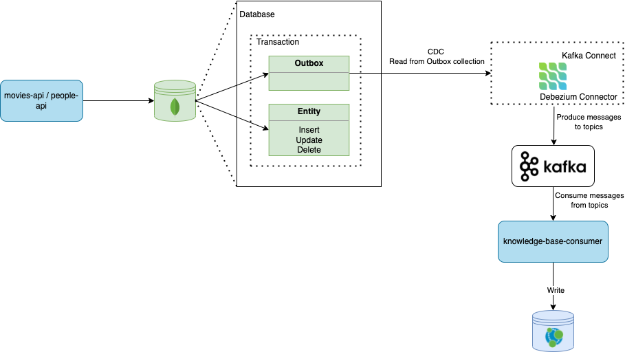
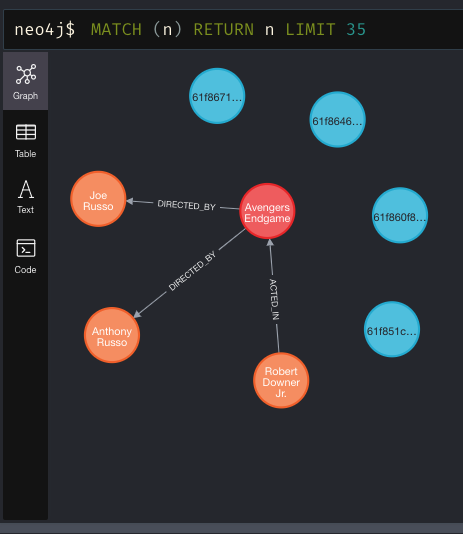

# Building a Knowledge Base Service With Neo4j, Kafka, and the Outbox Pattern

This repository contains the code for a small project that was built to support a [Medium article](https://medium.com/@thegoncalomartins/building-a-knowledge-base-service-with-neo4j-kafka-and-the-outbox-pattern-9fffeaa284a6).

## Requirements

* **[Gradle >= 7.0.2](https://gradle.org/releases/)**
* **[JDK >= 11](https://www.oracle.com/java/technologies/downloads/)**
* **[Docker](https://docs.docker.com/get-docker/)**
* **[Postman](https://www.postman.com/downloads/)**

## Documentation

### Domain Model



### Architecture



### Change Data Capture with Outbox Pattern



### Services

* ["People" Documentation](./people/README.md)
* ["Movies" Documentation](./movies/README.md)
* ["Knowledge Base" Documentation](./knowledge-base/README.md)

## Demo




## Running

To run all the services and infrastructure just run:
```bash
$ ./init.sh
```

It may take a while because all the gradle dependencies need to be downloaded and the source code compiled.

After the script has finished, the API Gateway should be exposed at port `8090`.

You can check that by running:
```bash
$ curl http://localhost:8090/__health
{"status":"OK"}
```

Open the [postman collection](postman/KnowledgeBaseWithOutboxPattern.postman_collection.json) and try to make some requests.
