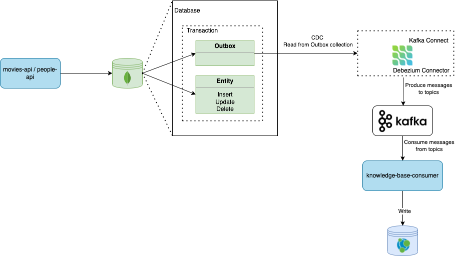
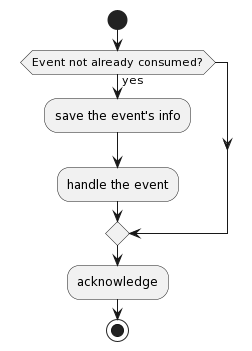

# Knowledge Base

`knowledge-base` is the service that aggregates and builds the knowledge base graph of the system. It offers a level three REST API
to query the graph.

## Documentation

### Architecture


### Package Diagram


### Use of Outbox and Inbox Patterns





The described flow can be achieved using the following classes:

* #### [InboxRepository class](common/src/main/kotlin/dev/goncalomartins/knowledgebase/common/repository/InboxRepository.kt)
```kotlin
class InboxRepository {
    private companion object {
        const val FIND_ONE_QUERY = "MATCH (event:InboxEvent) WHERE event.id = \$id RETURN event"
        const val CREATE_QUERY =
            """
                MERGE (:InboxEvent {id: ${'$'}id,
                aggregate_id: ${'$'}aggregate_id,
                event_type: ${'$'}event_type,
                aggregate_type: ${'$'}aggregate_type,
                payload: ${'$'}payload,
                timestamp: ${'$'}timestamp})
            """
    }

    fun findOne(transaction: RxTransaction, id: String): Uni<InboxEvent?> =
        Uni
            .createFrom()
            .publisher(
                transaction.run(
                    FIND_ONE_QUERY,
                    mapOf(
                        "id" to id
                    )
                ).records()
            )
            .map { record ->
                record?.let { InboxEvent.fromNode(it.get("event").asNode()) }
            }

    fun save(transaction: RxTransaction, inboxEvent: InboxEvent): Uni<Void> =
        Uni
            .createFrom()
            .publisher(
                transaction.run(
                    CREATE_QUERY,
                    mapOf(
                        "id" to inboxEvent.id,
                        "aggregate_id" to inboxEvent.aggregateId,
                        "event_type" to inboxEvent.eventType.name,
                        "aggregate_type" to inboxEvent.aggregateType.name,
                        "payload" to inboxEvent.payload,
                        "timestamp" to LocalDateTime.ofInstant(inboxEvent.timestamp, ZoneId.systemDefault())
                    )
                ).records()
            ).onItem()
            .ignore()
            .andContinueWithNull()
}
```

* #### [InboxService class](common/src/main/kotlin/dev/goncalomartins/knowledgebase/common/service/InboxService.kt)
```kotlin
class InboxService(val inboxRepository: InboxRepository) {
    fun save(transaction: RxTransaction, inboxEvent: InboxEvent): Uni<Void> =
        inboxRepository.save(transaction, inboxEvent)

    fun findOne(transaction: RxTransaction, id: String): Uni<InboxEvent?> = inboxRepository.findOne(transaction, id)
}
```

An example from [PeopleHandler class](consumer/src/main/kotlin/dev/goncalomartins/knowledgebase/consumer/handler/PeopleHandler.kt):
```kotlin
// ...
override fun handle(inboxEvent: InboxEvent): Uni<Void> =
    databaseUtils.inTransaction { transaction ->
        eventNotAlreadyConsumedAndSave(transaction, inboxEvent)
            .flatMap {
                Uni.createFrom().item { Person.fromInboxEvent(inboxEvent) }
            }
            .flatMap { person ->
                events[inboxEvent.eventType]!!.apply(transaction, person)
            }
    }.onFailure()
        .invoke { error -> logger.error(error.message, error) }

private fun eventNotAlreadyConsumedAndSave(transaction: RxTransaction, inboxEvent: InboxEvent) =
    inboxService.findOne(transaction, inboxEvent.id)
        .onItem()
        .ifNotNull()
        .failWith {
            EventAlreadyConsumedException(inboxEvent.id)
        }
        .flatMap {
            inboxService.save(transaction, inboxEvent)
        }
```

And [PeopleConsumer class](consumer/src/main/kotlin/dev/goncalomartins/knowledgebase/consumer/consumer/PeopleConsumer.kt):

```kotlin
class PeopleConsumer(val peopleHandler: PeopleHandler) : Consumer<String> {
    private companion object {
        const val PEOPLE_CHANNEL = "people"
    }

    private val logger = LoggerFactory.getLogger(javaClass)

    @Incoming(PEOPLE_CHANNEL)
    override fun consume(message: Message<String>): Uni<Void> =
        Uni
            .createFrom()
            .item {
                logger.info("Consuming event with payload ${message.payload}")
                InboxEvent.fromJsonObject(JsonObject(message.payload))
            }.flatMap { inboxEvent ->
                peopleHandler.handle(inboxEvent)
            }
            .flatMap {
                Uni.createFrom().completionStage {
                    logger.info("Success consuming event with payload ${message.payload}")
                    message.ack()
                }
            }
            .onFailure(EventAlreadyConsumedException::class.java)
            .recoverWithUni(
                Uni.createFrom().completionStage {
                    logger.info("Event with payload ${message.payload} was already consumed, acknowledging")
                    message.ack()
                }
            )
            .onFailure()
            .recoverWithUni { error ->
                Uni
                    .createFrom()
                    .completionStage {
                        logger.error("Error consuming event with payload ${message.payload}: ${error.message}", error)
                        message.nack(error)
                    }
            }
}
```

## Running

### Via Docker

```bash
$ docker-compose up -d api-gateway knowledge-base-api knowledge-base-consumer kafka knowledge-base-db
```

### Locally

#### Starting dependencies
```bash
$ docker-compose up -d kafka knowledge-base-db
```

#### API

```bash
$ ./gradlew clean build :web:quarkusDev -x test
```

#### Consumer

```bash
$ ./gradlew clean build :consumer:quarkusDev -x test
```

## Testing

### Starting dependencies
```bash
$ docker-compose -f ../docker-compose.test.yml up -d test-kafka test-knowledge-base-db
```

### Common
```bash
$ ./gradlew clean :common:build
```

### API
```bash
$ ./gradlew clean :web:build
```

### Consumer
```bash
$ ./gradlew clean :consumer:build
```
