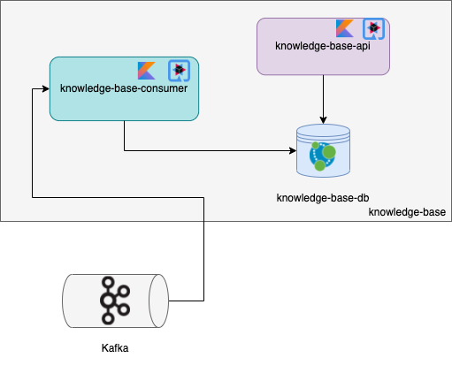

# Knowledge Base

`knowledge-base` is the service that aggregates and builds the knowledge base graph of the system. It offers a level three REST API
to query the graph.

## Documentation

### Architecture



### Package Diagram


## Running

### Via Docker

```bash
$ docker-compose up -d api-gateway knowledge-base-api knowledge-base-consumer kafka knowledge-base-db
```

### Locally

#### Starting dependencies
```bash
$ docker-compose up -d kafka knowledge-base-db
```

#### API

```bash
$ ./gradlew clean build :web:quarkusDev -x test
```

#### Consumer

```bash
$ ./gradlew clean build :consumer:quarkusDev -x test
```

## Testing

### Starting dependencies
```bash
$ docker-compose -f ../docker-compose.test.yml up -d test-kafka test-knowledge-base-db
```

### Common
```bash
$ ./gradlew clean :common:build
```

### API
```bash
$ ./gradlew clean :web:build
```

### Consumer
```bash
$ ./gradlew clean :consumer:build
```
