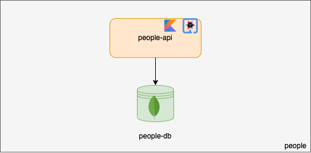
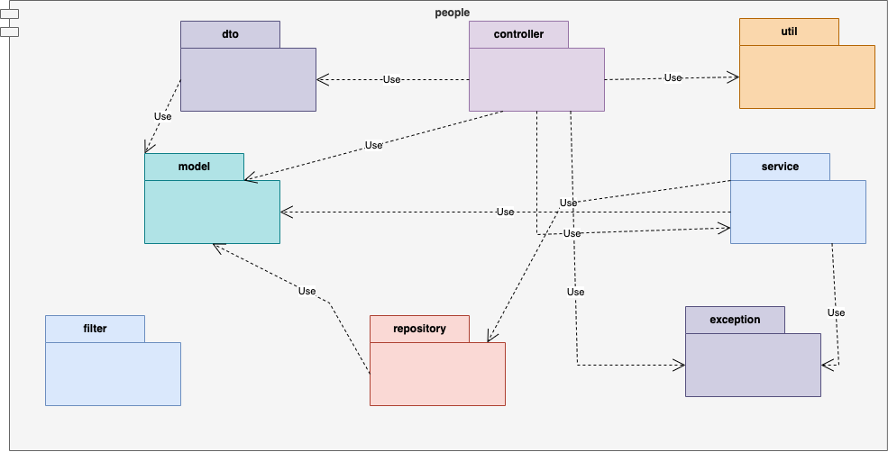

# People

`people` is the service that offers a level three REST API to perform CRUD (Create, Read, Update and Delete) operations for "Person" entity.

## Documentation

### Architecture



### Package Diagram



## Running

### Via Docker

```bash
$ docker-compose up -d api-gateway people-api people-db-primary people-db-secondary people-db-arbiter
```

### Locally

#### Starting dependencies

```bash
$ docker-compose up -d people-db-primary people-db-secondary people-db-arbiter
```

#### Running

```bash
$ ./gradlew clean build quarkusDev -x test
```

## Testing

### Starting dependencies
```bash
$ docker-compose -f ../docker-compose.test.yml up -d test-people-db-primary test-people-db-secondary test-people-db-arbiter
```

### Testing
```bash
$ ./gradlew clean build
```

## Debezium MongoDB Kafka Connector Configuration
```yaml
connector.class: io.debezium.connector.mongodb.MongoDbConnector
key.converter: org.apache.kafka.connect.storage.StringConverter
value.converter: org.apache.kafka.connect.json.JsonConverter
transforms: unwrap,createKey
mongodb.hosts: people-db-primary:27017
mongodb.user: root
mongodb.password: v5au8MVCvgh5BpSJ
mongodb.name: people-db
collection.include.list: people.outbox
transforms.createKey.type: org.apache.kafka.connect.transforms.ValueToKey
transforms.addPrefix.type: org.apache.kafka.connect.transforms.RegexRouter
transforms.createKey.fields: aggregate_id
transforms.unwrap.type: io.debezium.connector.mongodb.transforms.ExtractNewDocumentState
key.converter.schemas.enable: false
value.converter.schemas.enable: false
```
